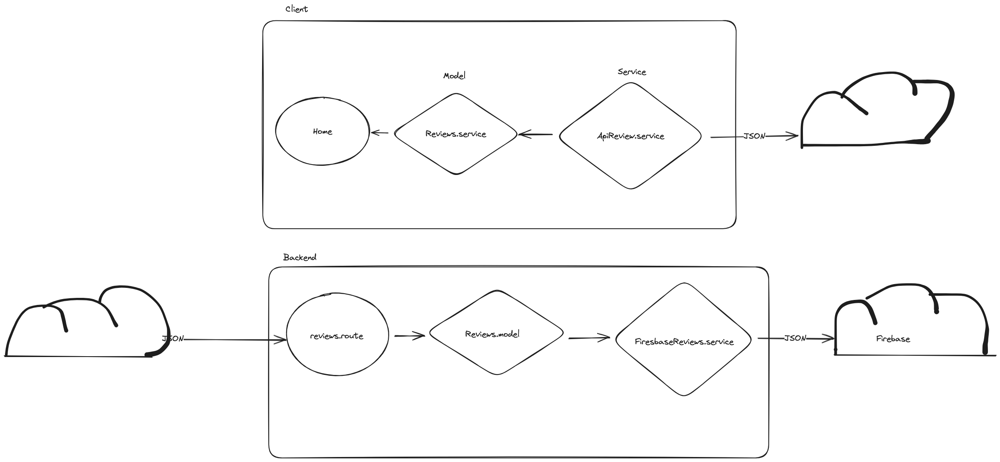
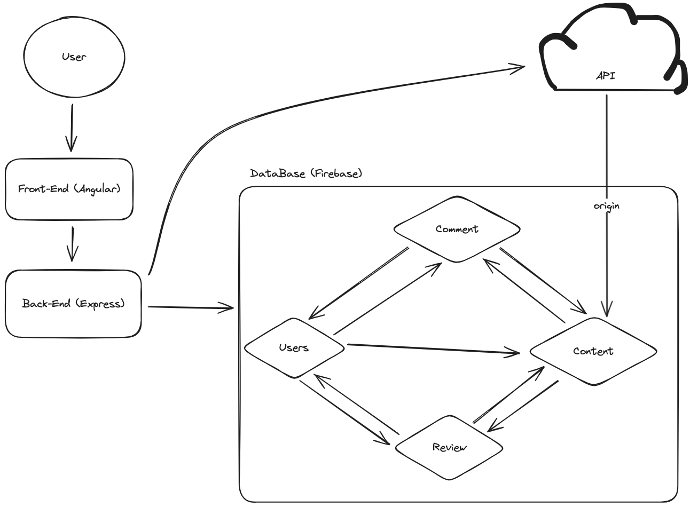

# uwuTracker

<div style="display:flex; justify-content: space-around">

- [uwuTracker](#uwutracker)
  - [Explicación de la estructura](#explicación-de-la-estructura)
    - [Cliente (*/client*) Frontend - Angular (typescript) - browser](#cliente-client-frontend---angular-typescript---browser)
    - [Servidor (*/server*) Backend - Express (javascript) - NodeJS](#servidor-server-backend---express-javascript---nodejs)
  - [Set up](#set-up)
    - [Variables de entorno](#variables-de-entorno)
      - [Cliente](#cliente)
      - [Servidor](#servidor)
    - [Comandos](#comandos)
  - [Arquitectura](#arquitectura)
  - [Base de datos](#base-de-datos)


</div>


## Explicación de la estructura

Aunque se maneje desde el mismo proyecto de **git**, tenemos internamente 2 proyectos de **npm**; cada uno con sus **dependencias** (librerías o paquetes) propias y diferentes entre sí.

### Cliente (*/client*) Frontend - Angular (typescript) - browser

Es la parte que el usuario cargara en el dispositivo desde el que se conecte a la web, es naturalmente inseguro, ya que es completamente manipulable por el usuario debido a que esta en su dispositivo. Por tanto, no puede manejar llamadas a bases de datos, contener datos sensibles y demás. (No todo lo que esta en el directorio */client* acabará en el dispositivo del usuario, esto es quizás mas complejo de explicar)

El cliente puede o no ser dado por el backend mediante una llamada, pero durante el desarrollo, se toman como 2 entes independientes. Ya que en el producto final, si queremos que el backend se ocupe de dar nuestra aplicación de angular, habrá que hacer un paso final.

El cliente se comunica con el backend mediante la API que este le ofrece.

### Servidor (*/server*) Backend - Express (javascript) - NodeJS

Es la parte del sistema que lleva la lógica de negocio, las llamadas a bases de datos, APIs y demás, en este caso usaremos una API REST, por tanto, se comunica mediante llamadas HTTP y la información va estructurada en formato JSON. El servidor solo puede mandar información al Frontend ante las llamadas de este. (Podría mandarla sin que sea una respuesta pero necesitamos cosas extra.)

En el directorio **public** del servidor, no debe ir nada que no queramos que el usuario vea, ya que ahi se encuentran los llamados archivos estáticos, todo aquello susceptible de ser mandado al cliente.

## Set up

### Variables de entorno

Por temas de seguridad y comodidad, existen las llamadas variables de entorno; variables que ya sean por su sensibilidad (como una KEY de una base de datos), o por su uso o posibilidad de cambiarse en función de si estamos en **producción** o **desarrollo**.

> Las variables de entorno bajo ningún concepto se deben guardar en ningún repositorio.

#### Cliente

En */client/src/environmets* tenemos 2 archivos:
    * **env.dev.ts** : Variables de entorno de desarrollo
    * **env.ts** : Variables de entorno standards

#### Servidor

En */server* tenemos 1 archivo (de momento):
    * **.env.dev** : Variables de entorno de desarrollo


### Comandos

Lo primero que debemos hacer es instalar las dependencias que necesitamos, si se instala alguna dependencia nueva, también necesitaremos usar este comando, recordemos que esto lo tenemos que aplicar tanto en cliente como en servidor:

```bash
$ npm install
```

Para lanzar cliente o servidor con el entorno modo desarrollo, que es como estamos trabajando actualmente, necesitaremos el siguiente comando, recordemos que al ser 2 proyectos diferentes, necesitaremos una consola para el cliente y otra para el servidor:

```bash
$ npm run dev
```

En los archivos *package.json* tenemos información de los comandos disponibles y de las dependencias del proyecto.

## Arquitectura

Estaremos usando un **Arquitectura hexagonal**, por lo que las llamadas externas tendrán varias capas, esto aunque a priori pueda parecer una tontería, a la larga será muy ventajoso.

Aquí un ejemplo de como será el uso de esta arquitectura:



## Base de datos

Aquí el esquema de las conexiónes de los modeles de la base de datos:

